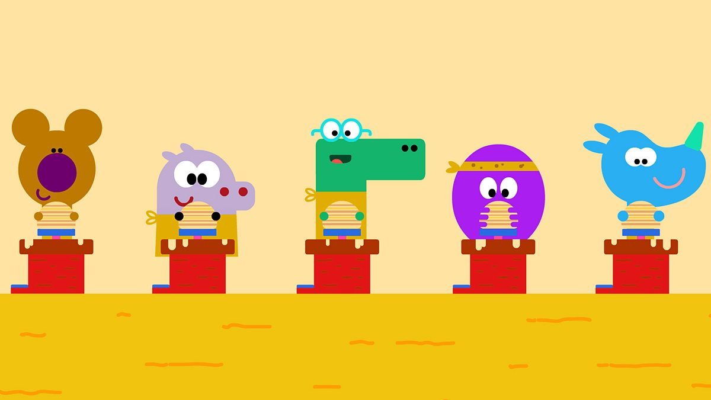
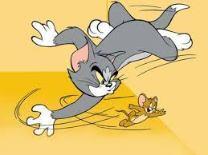
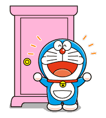

<html>
<title>A710160085</title>
<meta charset="UTF-8">
<meta name="viewport" content="width=device-width, initial-scale=1">
<link rel="stylesheet" href="https://www.w3schools.com/w3css/4/w3.css">
<link rel="stylesheet" href="https://fonts.googleapis.com/css?family=Raleway">

<body class="w3-light-grey">

<!-- w3-content defines a container for fixed size centered content, 
and is wrapped around the whole page content, except for the footer in this example -->

<!-- Header -->
<header class="w3-container w3-center w3-padding-32"> 
  <h1><b>ANIMASI 2D dan 3D</b></h1>
  
Selamat Datang di Animasiku 

</header>

<!-- Grid -->

<!-- Blog entries -->

  <!-- Blog entry -->
  

    
    

      <h3><b>CBEEBIES HEY DUGGEE</b></h3>
      <h5>Title description, Oktober 03, 2018</h5>
    

    

      
Cbeebies Hey Dugge adalah animasi 2D. Disebut animasi dua dimensi, karena 2D mempunyai ukuran panjang (X-azis) dan ( Y-axis). Realisasi nyata dalam perkembangan dua dimensi yang cukup revolusioner yakni film kartun. Dan animasi 2D adalah animasi yang menggunakan sketsa gambar, lalu sketsa gambar ini digerakkan satu persatu, maka tidak akan terlihat seperti nyata. Disebut animasi 2 dimensi karena dibuat melalui sketsa yang yang digerakan satu persatu sehingga nampak seperti nyata dan bergerak. Animasi 2D hanya bisa dilihat dari depan saja. Animasi sendiri berasal dari bahasa latin yaitu “anima” yang berarti jiwa, hidup, semangat. Sedangkan karakter adalah orang, hewan maupun objek nyata lainnya yang dituangkan dalam bentuk gambar 2D maupun 3D. shingga karakter animasi secara dapat diartikan sebagai gambar yang memuat objek yang seolah-olah hidup, disebabkan oleh kumpulan gambar itu berubah beraturan dan bergantian ditampilkan. Objek dalam gambar bisa berupa tulisan, bentuk benda, warna dan spesial efek.

     
    

  

  

  <!-- Blog entry -->
  

  
    

      <h3><b>RISE OF THE GUARDIANDS</b></h3>
      <h5>Title description, oKTOBER 03, 2018</h5>
    

    

      
Film ini merupakan salah satu film 3D yaitu objek animasi yang berada pada ruang 3D dan mempunyai panjang x, y dan z.
 berkisah tentang berkumpulnya para tokoh pahlawan dalam dunia dongeng untuk melawan kekuatan jahat yang berusaha menghancurkan impian anak-anak. Para pahlawan tersebut terdiri dari "North"/ Santa Claus, "Bunnymund"/Easter Bunny , "Tooth" the Tooth Fairy , Jack Frost serta tokoh jahatnya the Boogeyman.

    

  

<!-- END BLOG ENTRIES -->

<!-- Introduction menu -->

  <!-- About Card -->
  

  
    

      <h4><b>Biodataku</b></h4>
      
Hallo, Namaku Yustika Nurbaiti kalian bisa memanggilku Ayus, Aku disini akan memberikan pengetahuan buat kalian tentang Animasi 2D dan 3D yang diajarkan dosen animasiku selama kuliah di Universitas Muhammadiyah Surakarta. Semoga bermanfaat ya teman-teman.

    

  

  
  <!-- Posts -->
  

    

      <h4>Kartun Terpopuler</h4>
    

    <ul class="w3-ul w3-hoverable w3-white">
      <li class="w3-padding-16">
        
        TAYO 
        Animasi 2D
      </li>
      <li class="w3-padding-16">
        
        MASHA & THE BEAR 
        Animasi 3D
      </li> 
      <li class="w3-padding-16">
        
        TOM & JERRY 
        Animasi 2D
      </li>   
      <li class="w3-padding-16 w3-hide-medium w3-hide-small">
        
        DORAEMON 
        Animasi 2D
      </li>  
    </ul>
  

  
 
 
  <!-- Labels / tags -->
  

    

      <h4>Tags</h4>
    

    

    
Travel New York London
      IKEA NORWAY DIY
      Ideas Baby Family
      News Clothing Shopping
      Sports Games
    

    

  

  
<!-- END Introduction Menu -->

<!-- END GRID -->

 
<!-- END w3-content -->

<!-- Footer -->
<footer class="w3-container w3-dark-grey w3-padding-32 w3-margin-top">
  <button class="w3-button w3-black w3-disabled w3-padding-large w3-margin-bottom">Previous</button>
  <button class="w3-button w3-black w3-padding-large w3-margin-bottom">Next »</button>
  
Powered by <a href="https://www.w3schools.com/w3css/default.asp" target="_blank">w3.css</a>

</footer>
</body>
</html>
